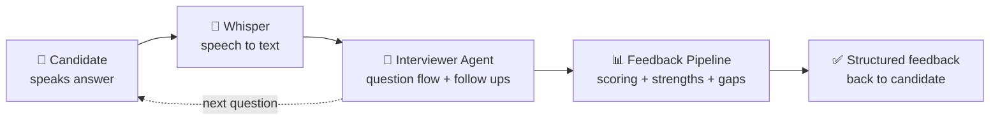

# Arcway

**AI interview practice that felt like the real thing**

 

*▶️ Click to watch the demo*

---

## What it did

Candidates picked a role, spoke their answers out loud to an AI interviewer, and got structured feedback within seconds of finishing. The goal was to make interview prep feel like the real thing instead of reading flashcards.

I built and ran Arcway through 2025 and 2026. It reached 30+ users and 200+ AI conducted interviews before I made the call to sunset it and point my time at a clearer opportunity.

## How it worked

| Layer | What ran it |
|---|---|
|  Frontend | Next.js |
|  Backend | Node.js + Express |
|  Database | MongoDB |
|  Voice | OpenAI Whisper |
|  Auth | JWT with user and admin roles |
|  Hosting | Railway + Cloudflare DNS |

## By the numbers

| | |
|---|---|
| Registered users | **30+** |
| Interviews conducted | **200+** |
| Avg interviews per user | **~23** |

## What I learned

**One big prompt doesn't scale.** The first version ran entire interviews off a single prompt. It drifted, lost context and gave inconsistent feedback. Splitting the system into an interviewer agent and a separate feedback pipeline fixed almost all of it and let me tune each piece on its own.

**Whisper was the right call for voice.** Interview answers are long, conversational and full of technical vocabulary. Browser speech APIs choked on them. Whisper handled them cleanly at a latency that worked fine for a turn based format.

**Real users find problems you never will.** 200+ interviews of actual usage drove more iteration than any amount of my own testing.

**Knowing when to stop is a skill.** The platform worked. I shut it down anyway, because the traction proved the build but the next year of my time was worth more pointed at a clearer opportunity.

## Why there's no code here

The codebase stays private. This repo is the case study: the demo, the architecture and the thinking behind it.

---

Built by **Matthew Allicock** · [LinkedIn](https://www.linkedin.com/in/matthew-allicock/)

